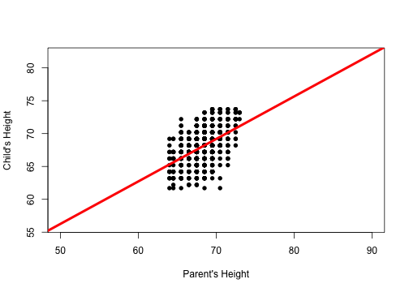

## Motivation and App Explanation

- We want to create an application to ``predict`` the child's height knowing the parent's height.
- We are using the data from the famous 1885 study of ``Francis Galton``, 
exploring the relationship between the heights of children and the 
height of their parents, to build our predicting model. The variables 
are the height of the adult child and the midparent height, defined as 
the average of the height of the father and 1.08 times the height 
of the mother. The units are inches. The number of cases is 928, 
representing 928 children and their 205 parents.
- As ``input`` we have the ``Parent's Height``.
- Inputs height work from `50` to `90` inches.
- As ``output`` we have the predicted ``Child's Height``.
- We have also a ``plot`` with our prediction, galton's data and the linear model we build.
- You can find the Applicatio here https://pinap.shinyapps.io/DDP_Project/


--- .class #id 

## Data Used

- We are using Galton's data from the `UsingR` library.


```r
library(UsingR)
```


```r
summary(galton)
```

```
##      child          parent    
##  Min.   :61.7   Min.   :64.0  
##  1st Qu.:66.2   1st Qu.:67.5  
##  Median :68.2   Median :68.5  
##  Mean   :68.1   Mean   :68.3  
##  3rd Qu.:70.2   3rd Qu.:69.5  
##  Max.   :73.7   Max.   :73.0
```

--- .class #id

## Linear Model


```
## 
## Call:
## lm(formula = child ~ parent, data = galton)
## 
## Residuals:
##    Min     1Q Median     3Q    Max 
## -7.805 -1.366  0.049  1.634  5.926 
## 
## Coefficients:
##             Estimate Std. Error t value Pr(>|t|)    
## (Intercept)  23.9415     2.8109    8.52   <2e-16 ***
## parent        0.6463     0.0411   15.71   <2e-16 ***
## ---
## Signif. codes:  0 '***' 0.001 '**' 0.01 '*' 0.05 '.' 0.1 ' ' 1
## 
## Residual standard error: 2.24 on 926 degrees of freedom
## Multiple R-squared:  0.21,	Adjusted R-squared:  0.21 
## F-statistic:  247 on 1 and 926 DF,  p-value: <2e-16
```

--- .class #id

## Plot Data and Linear Model


```r
plot(galton$parent, galton$child, xlab = "Parent's Height", ylab = "Child's Height", 
     pch = 16, xlim = c(50,90), ylim = c(56, 82))
abline(fit, col = "red", lwd = 4)
```


